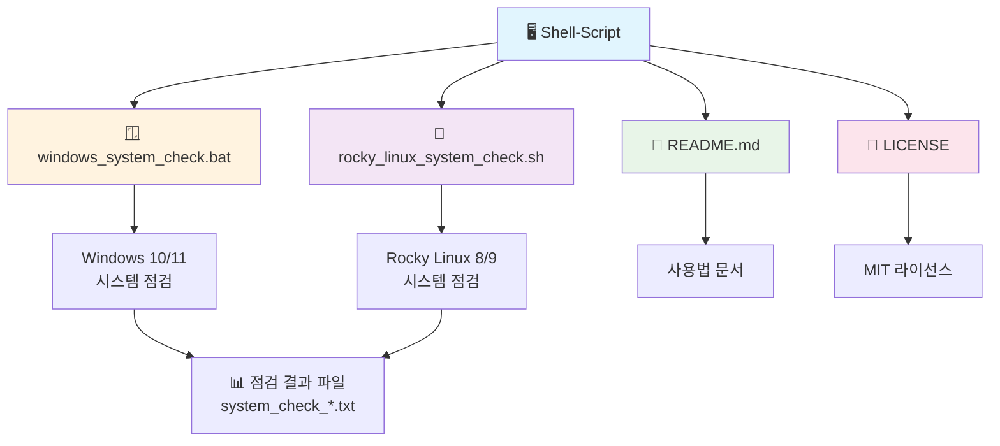

# 🖥️ 시스템 점검 스크립트 모음

**Windows 10/11과 Rocky Linux 8/9 환경을 위한 종합 시스템 점검 도구**

---

## 📖 개요

이 프로젝트는 시스템 관리자가 Windows와 Linux 환경에서 **빠르고 효율적으로** 시스템 상태를 종합 점검할 수 있도록 도와주는 스크립트 모음입니다.

### ✨ 주요 특징

<table>
<tr>
<td width="50%">

#### 🚀 **성능 최적화**
- ⚡ **초고속 실행**: 5-10초 내 완료
- 📊 **실시간 진행률**: 시각적 진행 상황 표시
- 🧠⚙️ **스마트 점검**: 필요한 정보만 선별적 수집

</td>
<td width="50%">

#### 🔧 **사용자 친화적**
- 🌏 **완전 한글화**: 모든 메시지 한글로 표시
- 📁 **자동 파일 생성**: 타임스탬프 결과 파일
- 📱 **간편한 실행**: 원클릭으로 모든 점검 완료

</td>
</tr>
</table>

---

## 📁 프로젝트 구조



### 📂 파일 상세 정보

| 파일명 | 설명 | 실행 환경 | 권한 |
|--------|------|-----------|------|
| `windows_system_check.bat` | Windows 시스템 종합 점검 | Windows 10/11 | 일반 사용자 및 관리자 |
| `rocky_linux_system_check.sh` | Rocky Linux 시스템 종합 점검 | Rocky Linux 8/9 | 일반 사용자 및 관리자 |
| `README.md` | 프로젝트 사용법 및 문서 | - | - |
| `LICENSE` | MIT 라이선스 파일 | - | - |

---

## 🚀 빠른 시작

<div align="center">

### ⚡ 원클릭 실행으로 5초 만에 시스템 점검 완료!

</div>

---

## 🪟 Windows 10/11

<div align="center">

[](https://www.microsoft.com/windows)

</div>

### 📥 설치 및 실행

```cmd
# 1️⃣ 저장소 클론
git clone https://github.com/xowk9876/OS_System_Check.git
cd OS_System_Check

# 2️⃣ 기본 실행 (진행률 표시)
windows_system_check.bat

# 3️⃣ 상세 정보와 함께 실행
windows_system_check.bat --verbose

# 4️⃣ 도움말 보기
windows_system_check.bat --help
```

### 🎯 실행 옵션

| 옵션 | 설명 | 예시 |
|------|------|------|
| 기본 실행 | 진행률 표시와 함께 실행 | `windows_system_check.bat` |
| `--verbose` | 상세한 디버그 정보 출력 | `windows_system_check.bat --verbose` |
| `--help` | 도움말 및 사용법 표시 | `windows_system_check.bat --help` |

---

## 🐧 Rocky Linux 8/9

<div align="center">

[](https://rockylinux.org/)

</div>

### 📥 설치 및 실행

```bash
# 1️⃣ 저장소 클론
git clone https://github.com/xowk9876/OS_System_Check.git
cd OS_System_Check

# 2️⃣ 실행 권한 부여
chmod +x rocky_linux_system_check.sh

# 3️⃣ 기본 실행 (진행률 표시)
./rocky_linux_system_check.sh

# 4️⃣ 상세 정보와 함께 실행
./rocky_linux_system_check.sh --verbose

# 5️⃣ 도움말 보기
./rocky_linux_system_check.sh --help
```

### 🎯 실행 옵션

| 옵션 | 설명 | 예시 |
|------|------|------|
| 기본 실행 | 진행률 표시와 함께 실행 | `./rocky_linux_system_check.sh` |
| `--verbose` | 상세한 디버그 정보 출력 | `./rocky_linux_system_check.sh --verbose` |
| `--help` | 도움말 및 사용법 표시 | `./rocky_linux_system_check.sh --help` |

---

## 📊 기능 비교표

<div align="center">

| 기능 | 🪟 Windows | 🐧 Rocky Linux | 📝 설명 |
|------|------------|----------------|---------|
| **실행 시간** | ⚡ 5-8초 | ⚡ 3-6초 | 초고속 시스템 점검 |
| **점검 항목** | 🔢 7개 카테고리 | 🔢 7개 카테고리 | 동일한 포괄적 점검 |
| **진행률 표시** | ✅ 실시간 | ✅ 실시간 | 시각적 진행 상황 표시 |
| **한글 지원** | ✅ 완전 지원 | ✅ 완전 지원 | 모든 메시지 및 출력을 한글로 표시 |
| **권한 요구** | 🔓 일반 사용자 | 🔓 일반 사용자 | 관리자 권한 불필요 |
| **결과 파일** | 📄 자동 생성 | 📄 자동 생성 | 타임스탬프 파일명 |
| **오류 처리** | 🛡️ 강화됨 | 🛡️ 강화됨 | 안전한 실행 보장 |

</div>

---

## 📋 점검 항목

<table>
<tr>
<td width="50%">

### 🪟 **Windows 10/11**

#### 1. **시스템 기본 정보**
- 운영체제 정보 (Windows 10/11 구분)
- 시스템 제조사 및 모델
- BIOS 버전
- 프로세서 정보
- 메모리 정보

#### 2. **하드웨어 상태**
- 메모리 사용량 및 상태
- 디스크 정보 및 사용률
- CPU 사용률 및 상태
- 온도 센서 정보

#### 3. **파일시스템 점검**
- 디스크 사용률
- 디스크 상태 점검
- 임시 파일 정보

#### 4. **네트워크 인터페이스**
- 주요 네트워크 어댑터 정보
- VPN 연결 상태
- 인터넷 연결 상태
- DNS 서버 정보
- 공용 DNS 서버 연결 테스트
- 라우팅 테이블 (주요 경로)
- **네트워크 티밍 구성 상태** (새로운 기능!)
  - NIC 티밍 팀 정보
  - 팀 관련 어댑터 확인
  - Hyper-V 가상 스위치 팀 구성
  - 네트워크 어댑터 바인딩 순서

#### 5. **서비스 및 포트**
- 주요 열린 포트 (상위 10개)
- 주요 서비스 상태 (WinRM, RemoteRegistry, Spooler, BITS)
- Windows 방화벽 상태 (도메인/개인/공용 프로필)

#### 6. **성능 상태**
- 시스템 부팅 시간
- 현재 시간
- 상위 프로세스 (상위 10개)
- 메모리 사용량

#### 7. **보안 점검**
- Windows 업데이트 상태
- Windows Defender 상태
- 관리자 권한 확인
- 사용자 계정 정보
- 로그인 실패 기록

</td>
<td width="50%">

### 🐧 **Rocky Linux 8/9**

#### 1. **시스템 기본 정보**
- OS 정보 (Rocky Linux 버전)
- 커널 정보
- 시스템 제조사 및 모델
- 프로세서 정보
- 메모리 정보

#### 2. **하드웨어 상태**
- 메모리 사용량 및 상태
- 디스크 정보 및 사용률
- CPU 사용률 및 상태
- 온도 센서 정보

#### 3. **파일시스템 점검**
- 디스크 사용률
- 파일시스템 타입
- inode 사용률
- 마운트 포인트 정보

#### 4. **네트워크 인터페이스**
- 네트워크 인터페이스 정보
- IP 주소 및 라우팅
- 네트워크 연결 상태
- DNS 설정
- **네트워크 본딩 구성 상태** (새로운 기능!)
  - 본딩 모듈 로드 상태
  - 본딩 인터페이스 및 모드 확인
  - 슬레이브 인터페이스 상태
  - NetworkManager 본딩 연결

#### 5. **서비스 및 포트**
- 열린 포트 정보
- 실행 중인 서비스
- 방화벽 상태 (firewalld)
- SELinux 상태

#### 6. **성능 상태**
- 시스템 업타임
- 로드 평균
- 상위 프로세스
- 메모리 사용량

#### 7. **보안 점검**
- 시스템 업데이트 상태
- 보안 포트 점검
- 사용자 계정 정보
- 로그인 실패 기록

</td>
</tr>
</table>

---

## ⚠️ 경고 임계값

<div align="center">

| 메트릭 | 🟢 정상 | 🟡 주의 | 🔴 경고 |
|--------|---------|---------|---------|
| **CPU 사용률** | < 70% | 70-80% | > 80% |
| **디스크 사용률** | < 75% | 75-85% | > 85% |
| **메모리 사용률** | < 80% | 80-90% | > 90% |

</div>

---

## 🔧 시스템 요구사항

### 🪟 Windows 10/11
- **OS**: Windows 10 (Build 1903+) / Windows 11
- **권한**: 일반 사용자 (일부 기능은 관리자 권한 필요)
- **명령어**: systeminfo, wmic, ipconfig, netstat, route, ping, sc

### 🐧 Rocky Linux 8/9
- **OS**: Rocky Linux 8.0+ / Rocky Linux 9.0+
- **Shell**: Bash 4.0 이상
- **권한**: 일반 사용자 (일부 기능은 sudo 권한 필요)
- **명령어**: systemctl, ss, netstat, df, free, top, ps, journalctl

---

## 📝 출력 파일 정보

| 항목 | 설명 |
|------|------|
| **파일명 형식** | `system_check_YYYY-MM-DD_HH-MM-SS.txt` |
| **저장 위치** | 스크립트와 동일한 디렉토리 |
| **파일 형식** | UTF-8 인코딩 텍스트 파일 |
| **내용** | 전체 점검 결과 및 로그 |

---

## 🛠️ 문제 해결

<details>
<summary><strong>🪟 Windows 관련 문제</summary>

### ❌ "wmic is not recognized" 오류
```cmd
# 해결방법: PowerShell 명령어로 자동 대체됨
# 추가 조치 불필요
```

### ❌ 한글 문자 깨짐 현상
```cmd
# 해결방법: UTF-8 인코딩 자동 설정됨
chcp 65001
```

### ❌ 관리자 권한 필요 오류
```cmd
# 해결방법: 관리자 권한으로 실행
# 우클릭 → "관리자 권한으로 실행"
```

</details>

<details>
<summary><strong>🐧 Rocky Linux 관련 문제</summary>

### ❌ "Permission denied" 오류
```bash
# 해결방법: 실행 권한 부여
chmod +x rocky_linux_system_check.sh
```

### ❌ 명령어를 찾을 수 없음
```bash
# 해결방법: 필요한 패키지 설치
sudo yum install net-tools procps-ng ss
```

### ❌ 일부 기능 권한 부족
```bash
# 해결방법: sudo 권한으로 실행
sudo ./rocky_linux_system_check.sh
```

</details>

---

## 📸 실행 결과 미리보기

<div align="center">

### 🪟 Windows 실행 화면

```cmd
🖥️  Windows 시스템 점검을 시작합니다...
═══════════════════════════════════════════════════════════════

📊 진행률: [████████████████████████████████████████] 100% (7/7)

✅ 시스템 점검 완료!
📄 결과 파일: system_check_2025-01-27_14-30-15.txt
⏱️  실행 시간: 6.2초
```

### 🐧 Rocky Linux 실행 화면

```bash
🖥️  Rocky Linux 시스템 점검을 시작합니다...
═══════════════════════════════════════════════════════════════

📊 진행률: [████████████████████████████████████████] 100% (7/7)

✅ 시스템 점검 완료!
📄 결과 파일: system_check_2025-01-27_14-30-15.txt
⏱️  실행 시간: 4.8초
```

</div>

---

## 📈 업데이트 이력

<details>
<summary><strong>📅 버전 히스토리</summary>

### 🆕 v2.1 (2025-01-27)
- ✅ **Linux 본딩 구성 상태 체크 기능 추가**
  - 본딩 모듈 로드 상태 확인
  - 본딩 인터페이스 및 모드 분석
  - 슬레이브 인터페이스 상태 모니터링
  - NetworkManager 본딩 연결 확인
- ✅ **Windows 티밍 구성 상태 체크 기능 추가**
  - NIC 티밍 팀 정보 분석
  - 팀 관련 어댑터 상태 확인
  - Hyper-V 가상 스위치 팀 구성
  - 네트워크 어댑터 바인딩 순서
- ✅ README.md에서 프로젝트 통계 섹션 제거
- ✅ 전문가 설명 간소화

### 🔧 v2.0 (2025-09-21)
- ✅ Windows Update 서비스 체크 제거
- ✅ 방화벽 상태 상세 정보 추가 (도메인/개인/공용 프로필)
- ✅ 바이러스 백신 상태 개선 (Windows Defender 상세 정보)
- ✅ 네트워크 정보 정리 (VMware, TAP 어댑터 필터링)
- ✅ 라우팅 테이블 용도 설명 추가
- ✅ DNS 서버 정보 확장
- ✅ PowerShell 구문 오류 완전 해결
- ✅ 모든 명령어를 안전한 배치 파일 명령어로 대체

</details>

---

## 📋 라이선스

이 프로젝트는 **MIT 라이선스** 하에 배포됩니다. 자세한 내용은 [LICENSE](LICENSE) 파일을 참조하세요.

---

## 👨‍💻 작성자

**Tae-system** 🚀

-  [GitHub](https://github.com/xowk9876)
-  [Instagram](https://www.instagram.com/tae_system/)

---

### ⭐ 이 프로젝트가 도움이 되었다면 Star를 눌러주세요!

**Made with ❤️ by Tae-system**